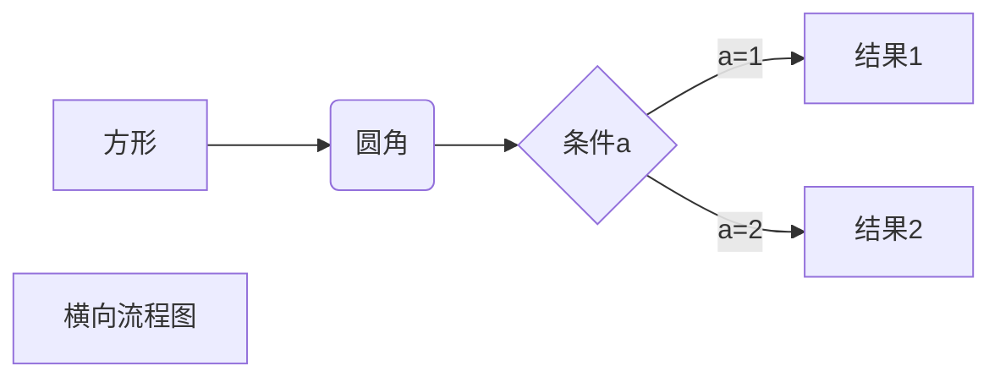
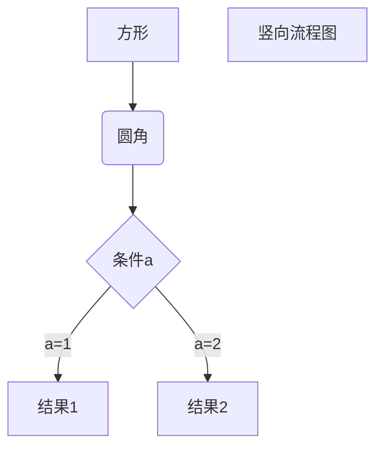

# Markdown基本语法

### 1.Markdown标题

使用`#`号标记

> 使用`#`可表示1-6级标题，一级标题对应一个`#`号，二级标题对应两个`#`号，以此类推。

```
# 一级标题
## 二级标题
### 三级标题
#### 四级标题
##### 五级标题
###### 六级标题
```

### 2.Markdown段落

Markdown段落没有特殊的格式，直接编写文字就好，段落的换行是使用两个以上空格加上回车。

#### 字体

Markdown可以使用以下几种字体：

```
*斜体文本*
_斜体文本_
**粗体文本**
__粗体文本__
***粗斜体文本***
___粗斜体文本___
```

`示例：`

**斜体文本**：

> *我是小斜文本一号*
>
> _我是小斜文本二号_

**粗体文本**：

> **我是小粗文本一号**
>
> __我是小粗文本二号__

**粗斜体文本**：

> ***我是小粗斜体文本一号***
>
> ___我是小粗斜体文本二号___

#### 分隔线

你可以在一行中用三个以上的`星号`、`中划线`、`下划线`来建立一个分割线，行内不能有其他东西。你也可以在星号或是减号中间插入空格。下面每种写法都可以建立分隔线。

```
*** 紧挨在一起的星号
* * * 中间有空格的星号
***** 大于3个的星号
- - - 中间有空格的中划线
--------- 紧挨在一起的大于3个的中划线
_________ 多个下划线
```

#### 删除线

如果段落上的文字要添加删除线，只需要在文字的两端加上两个波浪线`~~`即可，实例如下：

```
删除线文本一号
删除线文本二号
~~删除线文本三号~~ (波浪线需是在英文输入法下)
```

`示例`：

> 删除线文本一号
>
> 删除线文本二号
>
> ~~删除线文本三号~~

#### 下划线

下划线可以通过HTML的u标签来实现:

```
<u>带下划线文本</u>
```

</u>

#### 3.Markdown列表

Markdown支持有序列表和无序列表。

无序列表使用星号（*）、加号（+）或是减号（-）作为列表标记，这些标记后面要添加一个空格，然后再填写内容：

```
* 星号第一项
* 星号第二项
* 星号第三项
  
+ 加号第一项
+ 加号第二项
+ 加号第三项
  
- 减号第一项
- 减号第二项
- 减号第三项
```

显示结果如下：

* 星号第一项
* 星号第二项
* 星号第三项

+ 加号第一项
+ 加号第二项
+ 加号第三项

- 减号第一项
- 减号第二项
- 减号第三项

**有序列表使用数字并加上.(点号)来表示，如：**

```
 1. 第一项
 2. 第二项
 3. 第三项
```

显示结果如下：

1. 第一项
2. 第二项
3. 第三项

#### 列表嵌套

列表嵌套只需在子列表中的选项前面添加两个或四个空格即可：

```
1. 第一项：
    - 第一项嵌套的第一个元素
    - 第一项嵌套的第二个元素
2. 第二项：
    - 第二项嵌套的第一个元素
    - 第二项嵌套的第二个元素
```

显示结果如下：

1. 第一项：

   - 第一项嵌套的第一个元素
   - 第一项嵌套的第二个元素
2. 第二项：

   - 第二项嵌套的第一个元素
   - 第二项嵌套的第二个元素

#### 4.Markdown区块

Markdown区块引用是在段落开头使用>符号，然后后面紧跟一个空格符号：

```
> 我是Markdown区块  
>> 第二层
>>> 第三层
```

显示结果如下：

> 我是Markdown区块
>
>> 第二层
>>
>>> 第三层嵌套
>>>
>>

**区块中使用列表**

显示结果如下：

> 区块中使用列表
>
> 1. 第一项
> 2. 第二项
>
> + 第一项
> + 第二项
> + 第三项

**列表中使用区块**

如果要在列表项目内放进区块，那么就需要在>前添加四个空格的缩进。

显示结果如下：

* 第一项

  > 我是引用项
  >
* 第二项

#### 5.Markdown代码

如果是段落上的一个函数或片段的代码可以用反引号把它包起来（`）,例如：

```
`printf()`函数
```

显示结果如下：

`printf()`函数

**代码区块**

代码区块使用4个空格或者一个制表符（Tab键）。

显示结果如下：

```
我是代码区块
```

也可使用`(```)`包裹一段代码，并指定一种语言（也可以不指定）：

```javascript
const appElem = document.getElementByID('app')  
console.log(appElem)
```

#### 6.Markdown表格

Markdown制作表格使用`｜`来分隔不同的单元格，使用`-`来分隔表头和其他行。

语法格式如下：

```javascript
|表头1 | 表头2 |
| ---- | ---- |
| 单元格 | 单元格 |
| 单元格 | 单元格 |
```


| 表头1  | 表头2  |
| -------- | -------- |
| 单元格 | 单元格 |
| 单元格 | 单元格 |

对齐方式

**我们可以设置表格的对齐方式：**

+ `-:` 设置内容和标题栏居右对齐。
+ `:-` 设置内容和标题栏居左对齐。
+ `:-:` 设置内容和标题栏居中对齐。

示例：

```javascript
| 左对齐 | 右对齐 | 居中对齐 |
| :---- | ----: | :----: |
| 单格 | 单格 | 单格 |
| 单格 | 单格 | 单格 |
```


| 左对齐 | 右对齐 | 居中对齐 |
| :------- | -------: | :--------: |
| 单格   |   单格 |   单格   |
| 单格   |   单格 |   单格   |




